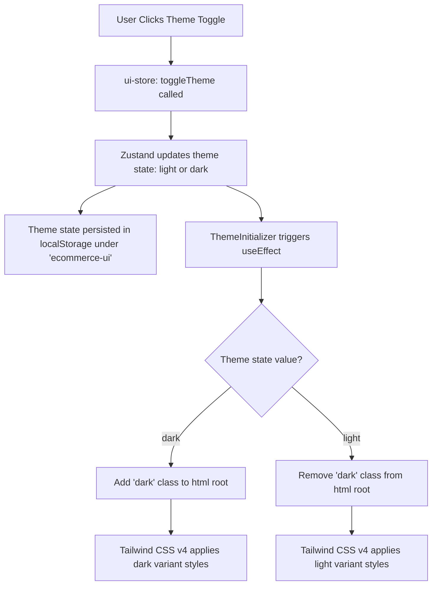
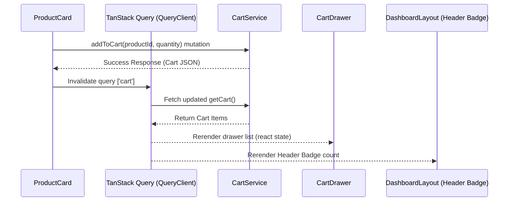

# 🚀 ApexCart — Premium Next.js Frontend Developer Guide

Welcome to **ApexCart**, a high-performance, modern, and pixel-perfect e-commerce frontend. This project is built using **Next.js (v16 App Router)**, **TypeScript**, **Tailwind CSS v4**, **Zustand** (global client state), **React Query** (server-state synchronization), and **Axios** (network layer). 

This guide serves as a detailed developer reference explaining the system architecture, directory structure, data flows, UI component details, global states, and custom UI design coordination.

---

## 📂 Project Directory Structure

Here is the complete layout of the frontend project:

```text
nextjs-frontend/
├── app/                      # Next.js App Router root
│   ├── dashboard/            # Protected Dashboard Layout & Views
│   │   ├── orders/           # Order History Page
│   │   │   └── page.tsx      # Order listing view
│   │   ├── profile/          # User Account Details Page
│   │   │   └── page.tsx      # User profile, statistics, and session details
│   │   ├── layout.tsx        # Dashboard shell: Sticky header, navigation, and cart integration
│   │   └── page.tsx          # Catalog product grid & category filters
│   ├── login/                # Auth Login page
│   │   └── page.tsx          # Login form, validation, and credentials submission
│   ├── register/             # Auth Registration page
│   │   └── page.tsx          # Register form with password requirements
│   ├── favicon.ico           # Website favicon icon
│   ├── globals.css           # Tailwind CSS v4 variables, theme config & utility animations
│   ├── layout.tsx            # Global Root Layout: Sets up fonts, providers, guard wrapper
│   └── page.tsx              # Home router redirect loader
├── components/               # Global & Custom UI Shared Components
│   ├── ui/                   # Modular Shadcn-style custom primitives
│   │   ├── badge.tsx         # Customizable chip for categories, inventory, and order status
│   │   ├── button.tsx        # Fully-featured button with custom variants and loading spinners
│   │   ├── card.tsx          # Standard card layouts utilizing .glass-panel styles
│   │   ├── dialog.tsx        # Lightweight custom overlay modal
│   │   ├── drawer.tsx        # Slide-out drawer wrapper positioning elements on the side
│   │   ├── input.tsx         # Label-wrapped and validation-ready custom text input
│   │   └── skeleton.tsx      # Loading state pulse placeholder
│   ├── auth-guard.tsx        # Session interceptor & Route protection barrier
│   └── theme-initializer.tsx # Bypasses hydration lag to initialize theme class
├── features/                 # Modular, Domain-specific Layout Features
│   ├── cart/                 # Cart Domain
│   │   ├── cart-drawer.tsx   # Side-panel cart displaying quantities, subtotals, mutations
│   │   └── checkout-modal.tsx# Confirmation dialog triggering order submission on the server
│   └── products/             # Products Domain
│       └── product-card.tsx  # Product tile containing hover actions, quantity control, detail modal
├── lib/                      # Helper Libraries
│   └── utils.ts              # Contains Tailwind class merges (cn) and price formatting
├── providers/                # Client Context Providers
│   └── query-provider.tsx    # Initiates & configs React Query's Client
├── schemas/                  # Client-side Form Validation Schemas
│   └── auth-schema.ts        # Zod verification patterns for auth forms
├── services/                 # API Connections (Server Interaction layer)
│   ├── api.ts                # Custom Axios instance configurations (credentials & cookies)
│   ├── auth.ts               # Login, register, and logout requests
│   ├── cart.ts               # Cart CRUD backend operations
│   ├── orders.ts             # Checkout, order listing, and single order details fetcher
│   └── products.ts           # Product retrieval and management endpoints
└── store/                    # Local Client State Management (Zustand)
    ├── auth-store.ts         # User object retention and persistent login status
    └── ui-store.ts           # Sidebar toggles, search text, categories, and theme options
```

---

## 🔄 Core Architectural Flows & Detailed Logic

### 1. Global Theme Management (Light vs. Dark Mode)
Theme management in ApexCart is configured through a mix of **Zustand client state**, a **DOM injector component**, and **Tailwind CSS v4 custom variants**.



- **Theme Store State**: Managed in [ui-store.ts](file:///c:/Users/ayush/Downloads/ecommerce/nextjs-frontend/store/ui-store.ts). State persists to `localStorage` under `ecommerce-ui` using Zustand's `persist` middleware, saving only the `theme` field (`partialize: (state) => ({ theme: state.theme })`). The default theme is `dark`.
- **Injection Control**: To prevent hydration flash (where server-rendered HTML doesn't match client-side theme preference), [theme-initializer.tsx](file:///c:/Users/ayush/Downloads/ecommerce/nextjs-frontend/components/theme-initializer.tsx) runs in the browser immediately on mount, bypasses asynchronous store hydration lag by direct reading from raw `localStorage`, and appends or removes the `.dark` class from `document.documentElement`.
- **Tailwind v4 Configuration**: Configured in [globals.css](file:///c:/Users/ayush/Downloads/ecommerce/nextjs-frontend/app/globals.css):
  - `@variant dark (&:where(.dark, .dark *));` configures class-based dark mode selector.
  - CSS variables define design tokens (colors, borders, adaptive shadows) inside `:root` (light theme: Myntra-inspired blue accent) and `.dark` (dark theme: Snitch streetwear-inspired deep black layout).
  - Background and text transitions are handled globally on the HTML `body` with `transition: background-color 0.3s ease, color 0.3s ease;` to create a smooth blending effect.

---

### 2. Layout, Navigation, and Responsiveness
The interface layout is configured at two levels: the global root layout and the protected dashboard layout.

- **Global Shell**: [layout.tsx](file:///c:/Users/ayush/Downloads/ecommerce/nextjs-frontend/app/layout.tsx) is a Server Component setting up document tags, importing Geist & Geist Mono fonts, and nesting context wrappers:
  ```tsx
  <html lang="en" className="..." suppressHydrationWarning>
    <body className="min-h-full flex flex-col bg-background text-foreground">
      <ThemeInitializer />
      <QueryProvider>
        <AuthGuard>
          {children}
          <Toaster richColors position="top-right" closeButton />
        </AuthGuard>
      </QueryProvider>
    </body>
  </html>
  ```
- **Dashboard Shell**: [layout.tsx](file:///c:/Users/ayush/Downloads/ecommerce/nextjs-frontend/app/dashboard/layout.tsx) is a protected shell enclosing all core pages. It features:
  - **Premium Backdrop**: Two absolute gradient glow panels with high blurs (`blur-[150px] bg-primary/3`) to implement a soft, luxurious feel.
  - **Sticky Header**: Uses `sticky top-0 z-40 bg-background/40 backdrop-blur-xl border-b border-border/10` to remain fixed during scroll while blending with the background.
  - **Desktop Navigation**: Links inline in the header displaying badge states reflecting paths.
  - **Mobile Dock**: A bottom navigation layout (`md:hidden`) rendering icon selectors at the bottom of the screen.
  - **Cart Count Badge**: Synchronized with server data via TanStack Query. Refetches on a `12000ms` (12 seconds) interval.
  - **User Pill**: Custom rounded badge showing user's name/email, with responsive clipping.

---

### 3. Authentication & User Details Storage
Authentication uses **secure cookie-based JWT sessions** on the backend combined with **Zustand state synchronization** on the client.

- **Token Storage**: The application does not store JWT tokens in `localStorage` or JavaScript state. This prevents Cross-Site Scripting (XSS) attacks. Tokens are set on the client by the server as an **HTTP-Only, Secure Cookie** named `access_token`.
- **Axios Configuration**: In [api.ts](file:///c:/Users/ayush/Downloads/ecommerce/nextjs-frontend/services/api.ts), the Axios client includes `withCredentials: true`. This informs the browser to automatically attach the session cookies to every outbound cross-origin API call.
- **User Detail Storage**: Retained in [auth-store.ts](file:///c:/Users/ayush/Downloads/ecommerce/nextjs-frontend/store/auth-store.ts). When authentication is successful, the user details (`id`, `name`, `email`) are stored in memory and persisted into `localStorage` under `ecommerce-auth`.
- **Route Protection & Session Interception**: Handled in [auth-guard.tsx](file:///c:/Users/ayush/Downloads/ecommerce/nextjs-frontend/components/auth-guard.tsx):
  - **Axios 401 Interceptor**: Configures a response interceptor. If any API endpoint returns a `401 Unauthorized` response (indicating the cookie token expired or was cleared), the store calls `clearAuth()` and redirects the client back to `/login`.
  - **Verify Session on Mount**: When a user returns to the app, the guard triggers `cartService.getCart()`. If the server responds with a valid cart, the session is active. If it fails, the user is signed out.
  - **Routing Redirect Logic**: Redirects anonymous users away from the dashboard routes, and authenticated users away from `/login` / `/register` pages.

---

### 4. Cart Management & Drawer Coordination
The shopping cart uses **optimistic React Query mutations** and **persistent side drawers** to manage product additions, quantity edits, and state invalidations.



- **Query Key**: The cart state is managed under the query key `['cart']`.
- **Side Panel Drawer**: The cart drawer ([cart-drawer.tsx](file:///c:/Users/ayush/Downloads/ecommerce/nextjs-frontend/features/cart/cart-drawer.tsx)) sits inside [DashboardLayout](file:///c:/Users/ayush/Downloads/ecommerce/nextjs-frontend/app/dashboard/layout.tsx). It receives the state `isOpen` from the global `useUIStore()`.
- **Lazy Loading**: The react-query inside the drawer is configured with `enabled: isOpen`. This ensures cart details are fetched from the server *only when the drawer is open*, minimizing server loads.
- **Quantity Mutations**:
  - **Increment**: Verified against available server stock (`item.quantity >= item.stock`). If it fits, calls `cartService.updateQuantity` and invalidates `['cart']`.
  - **Decrement**: If quantity drops to `1`, clicking minus automatically triggers `cartService.removeFromCart` to clean up the item.
  - **Remove / Clear**: Direct mutations triggering immediate `['cart']` invalidations.

---

### 5. Order Placement, Success modals, and History
Placing orders interacts directly with the cart endpoint to ensure transactional safety.

- **Order Placer**: Controlled by [checkout-modal.tsx](file:///c:/Users/ayush/Downloads/ecommerce/nextjs-frontend/features/cart/checkout-modal.tsx):
  1. User opens cart drawer -> Clicks Checkout -> Opens `CheckoutModal`.
  2. Clicking "Confirm & Place" triggers `placeOrderMutation` calling `ordersService.placeOrder('COD')`.
  3. The backend validates items, updates the stock levels of the ordered products, clears out the active user's cart model, and returns the generated `Order` JSON.
  4. On success, `CheckoutModal` invalidates both the `['cart']` and `['orders']` query keys to notify the rest of the application that data is stale.
  5. The modal switches local state `orderPlaced` to `true`, displaying a success receipt including Order ID, payment terms, and total amount.
- **Order History Viewer**: Located in [orders/page.tsx](file:///c:/Users/ayush/Downloads/ecommerce/nextjs-frontend/app/dashboard/orders/page.tsx). It triggers `ordersService.getOrders()` on mount, rendering a detailed, chronological invoice layout. It maps order statuses (`Pending`, `Processing`, `Shipped`, `Delivered`, `Cancelled`) to styled badge variants.

---

### 6. Side Alignment of Drawer Overlays
The application layout slides drawer overlays from the right side.

- **Drawer Shell styling**: In [drawer.tsx](file:///c:/Users/ayush/Downloads/ecommerce/nextjs-frontend/components/ui/drawer.tsx), the drawer overlays the viewport:
  - **Outer Frame**: Absolute layer aligned to the right side of the screen:
    ```tsx
    <div className="absolute inset-y-0 right-0 pl-10 max-w-full flex">
    ```
  - **Sliding Panels**: Animate from the right edge with a custom bezier transition:
    ```css
    animate-in slide-in-from-right duration-300
    ```
  - **Backdrop Blur**: An overlay covering the background with blur effects (`backdrop-blur-sm bg-background/80`) that blocks backdrop scroll and registers outside-clicks to close the drawer.
- **Dialog Shell styling**: In [dialog.tsx](file:///c:/Users/ayush/Downloads/ecommerce/nextjs-frontend/components/ui/dialog.tsx), confirm screens (like `CheckoutModal` or product detail modal) center on screen with a zoom-in entrance transition:
  ```css
  animate-in zoom-in-95 duration-300
  ```

---

## 💻 Detailed Code Analysis of UI & Page Components

### ⚙️ UI Components (`components/ui/`)

#### 1. [badge.tsx](file:///c:/Users/ayush/Downloads/ecommerce/nextjs-frontend/components/ui/badge.tsx)
Used for category chips, inventory warning labels, and order statuses.
- **Props**: Inherits standard `React.HTMLAttributes<HTMLDivElement>` and supports a `variant` property.
- **Variants**:
  - `default`: Primary background.
  - `secondary`: Neutral dark/light background.
  - `outline`: Border style.
  - `success`: Green badge (used for delivered orders and active profiles).
  - `destructive`: Red badge (used for cancelled orders and out of stock notices).
  - `warning`: Amber badge (used for pending status and low stock alerts).

#### 2. [button.tsx](file:///c:/Users/ayush/Downloads/ecommerce/nextjs-frontend/components/ui/button.tsx)
The global interactive control element.
- **Core features**:
  - **Click micro-animation**: Uses `active:scale-[0.98]` to create physical press feedback.
  - **Variants**: `primary`, `secondary`, `outline`, `ghost`, `destructive`, `link`.
  - **Sizes**: `sm` (height 36px), `md` (height 40px), `lg` (height 44px), `icon` (square layout).
  - **Async state integration**: Accepts an `isLoading` prop. When true, it renders a spinning SVG circle alongside or in place of children, and sets `disabled={true}` to block duplicate clicks during loading.

#### 3. [card.tsx](file:///c:/Users/ayush/Downloads/ecommerce/nextjs-frontend/components/ui/card.tsx)
Grid structure element. Subcomponents include `CardHeader`, `CardTitle`, `CardDescription`, `CardContent`, and `CardFooter`.
- **Card Panel Styling**: Wrapped in the custom css utility `.glass-panel` which applies shadow-blur effects.
- **Dark Mode adaptation**:
  - Light mode: Soft blue shadow (`rgb(59 130 246 / 0.03)`).
  - Dark mode: Hard black shadow (`rgb(0 0 0 / 0.5)`).
  - Hover states: Elevates the box shadow and shifts borders toward primary blue (`border-primary/50`).

#### 4. [dialog.tsx](file:///c:/Users/ayush/Downloads/ecommerce/nextjs-frontend/components/ui/dialog.tsx)
Custom portal dialog for overlay content.
- **Functional logic**:
  - Sets `document.body.style.overflow = 'hidden'` when active to prevent background scrolling.
  - Registers a window event listener for the `Escape` key to close the dialog.
  - Render details: Backdrop `div` covers the viewport. Clicking on the backdrop triggers the `onClose` callback.

#### 5. [drawer.tsx](file:///c:/Users/ayush/Downloads/ecommerce/nextjs-frontend/components/ui/drawer.tsx)
Used for the side-cart overlay.
- **Functional logic**:
  - Listens to global `isOpen` states.
  - Manages `body` scroll lock and `Escape` key triggers.
  - Positioned to the right of the screen (`right-0`). Slide transitions are handled by Tailwind's `slide-in-from-right` transition.

#### 6. [input.tsx](file:///c:/Users/ayush/Downloads/ecommerce/nextjs-frontend/components/ui/input.tsx)
Text fields for forms.
- **Core features**:
  - Utilizes React's `useId` hook to link label elements with inputs for accessibility (ARIA compliance).
  - Receives `error` parameters, dynamically turning borders red and rendering error messages underneath.

#### 7. [skeleton.tsx](file:///c:/Users/ayush/Downloads/ecommerce/nextjs-frontend/components/ui/skeleton.tsx)
Loading placeholder component.
- Uses `animate-pulse bg-muted/80` to render grey shape placeholders during catalog loads.

---

### 🎨 Feature Layouts (`features/`)

#### 1. [product-card.tsx](file:///c:/Users/ayush/Downloads/ecommerce/nextjs-frontend/features/products/product-card.tsx)
Implements product tiles.
- **Detail View Trigger**: Clicking the card triggers `setDetailOpen(true)` to display the detailed product modal.
- **Action Isolation**: Interactive elements inside the footer (like the minus/plus keys and Add button) include `onClick={(e) => e.stopPropagation()}` to prevent opening the detail modal when adjusting quantities.
- **Mutation logic**: Connects with TanStack Query's `useMutation` on `cartService.addToCart`. On success, it calls `invalidateQueries(['cart'])` to sync the header count and drawer listings.

#### 2. [cart-drawer.tsx](file:///c:/Users/ayush/Downloads/ecommerce/nextjs-frontend/features/cart/cart-drawer.tsx)
The shopping cart interface.
- Renders item images, names, quantities, and prices.
- Quantity changes trigger `updateQuantityMutation` which updates the cart state on the server.
- The checkout button opens the `CheckoutModal` overlay.

#### 3. [checkout-modal.tsx](file:///c:/Users/ayush/Downloads/ecommerce/nextjs-frontend/features/cart/checkout-modal.tsx)
The final stage of the order flow.
- Displays order totals and confirmation details.
- On click, triggers `placeOrderMutation` calling `ordersService.placeOrder('COD')`.
- Displays the order receipt details on successful completion.

---

### 📄 Pages & Views (`app/`)

#### 1. [app/page.tsx](file:///c:/Users/ayush/Downloads/ecommerce/nextjs-frontend/app/page.tsx)
- Initial landing redirect. Renders a loading spinner (`Loader2`) and relies on `AuthGuard` to redirect the user to `/dashboard` (if logged in) or `/login` (if anonymous).

#### 2. [login/page.tsx](file:///c:/Users/ayush/Downloads/ecommerce/nextjs-frontend/app/login/page.tsx)
- The login interface. Uses **React Hook Form** resolved with Zod's `loginSchema`.
- Password visibility can be toggled via local state.
- Submissions trigger `authService.login()`, store user state, and redirect to the dashboard. Includes a floating theme toggle button in the top right.

#### 3. [register/page.tsx](file:///c:/Users/ayush/Downloads/ecommerce/nextjs-frontend/app/register/page.tsx)
- Account registration page. Uses Zod's `registerSchema` to enforce a minimum password length of 6 characters.
- Successful registrations redirect users to `/login`.

#### 4. [dashboard/page.tsx](file:///c:/Users/ayush/Downloads/ecommerce/nextjs-frontend/app/dashboard/page.tsx)
- The product catalog grid.
- **Search & Filters**: Integrates search inputs and category filters with `useUIStore`.
- **Category Chips**: Generates categories dynamically from available products:
  `['All', ...Array.from(new Set(products.map((p) => p.category)))]`
- **Data Seeder**: If the database is empty, it displays an empty state illustration with a "Seed Demo Product Catalog" button. Clicking this seeds the backend database with 6 mock products.

#### 5. [dashboard/orders/page.tsx](file:///c:/Users/ayush/Downloads/ecommerce/nextjs-frontend/app/dashboard/orders/page.tsx)
- Displays chronological order lists.
- Dynamically maps order status types to badge variants. Shows nested line items, product quantities, unit prices, and overall order details.

#### 6. [dashboard/profile/page.tsx](file:///c:/Users/ayush/Downloads/ecommerce/nextjs-frontend/app/dashboard/profile/page.tsx)
- Customer Profile Page.
- Displays metrics calculated from order history, including **Total Orders**, **Total Spent**, and **Last Order Date**.
- Renders profile credentials (Name, Email, Account ID) fetched from the local Zustand auth store.

---

## 🛠️ Next.js + TypeScript + Tailwind + Shadcn Synergy

The architecture of ApexCart is based on the interaction of four core frontend technologies:

### 1. Next.js (v16 App Router)
Next.js provides routing and layout structures:
- **Nested Routing**: Defined using folder paths (`dashboard/orders`, `dashboard/profile`).
- **Client Components**: Pages and features use the `'use client'` directive to enable dynamic browser features (like React hooks, state, and browser APIs) while benefiting from static layout shells.

### 2. TypeScript
TypeScript ensures type safety across the application:
- Entity models are defined in [types/index.ts](file:///c:/Users/ayush/Downloads/ecommerce/nextjs-frontend/types/index.ts) (`User`, `Product`, `CartItem`, `Order`).
- Serves as the single source of truth for component props, API parameters, and validation schemas, reducing runtime errors.

### 3. Tailwind CSS v4
Tailwind CSS v4 manages application styling:
- Utilizes CSS variables defined in [globals.css](file:///c:/Users/ayush/Downloads/ecommerce/nextjs-frontend/app/globals.css) for color mapping and theme tokens.
- Supports class-based dark mode variants (`.dark`).
- Implements micro-animations (`spring-transition`, `active:scale-[0.98]`, `animate-in zoom-in-95`, etc.) to improve the user experience.

### 4. Custom Shadcn Architecture
Rather than importing heavy external component libraries, ApexCart uses custom UI components:
- UI components are built directly in [components/ui](file:///c:/Users/ayush/Downloads/ecommerce/nextjs-frontend/components/ui).
- Code is kept clean, lightweight, and easy to modify, with direct access to Tailwind classes.
- Ensures fast load times and clean component coordination without external npm dependencies.

---

## 🚀 Running the Development Server

To start the local development environment:

```bash
# Install dependencies
npm install

# Start Next.js development server (runs on port 3000)
npm run dev
```

Ensure your NestJS backend service is running locally on port `5000` (or the port defined in your API configuration). Next.js API requests are proxied directly to the backend service.
